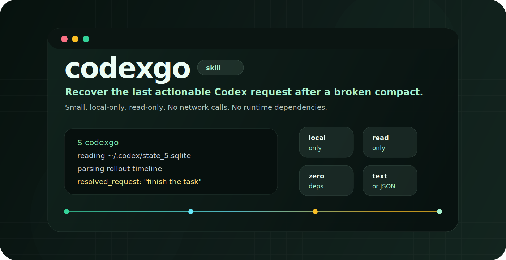
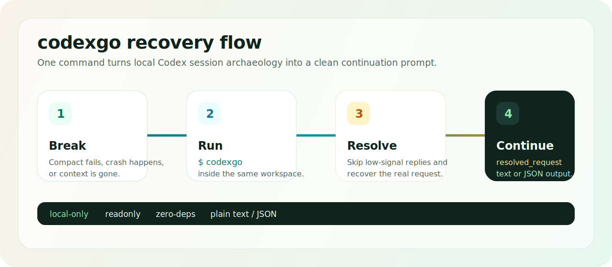

<p align="center">
  
</p>

<p align="center">
  <a href="README.en.md">English</a>
  ·
  <a href="https://github.com/JY0xLU/codexgo">GitHub</a>
</p>

<p align="center">
  <a href="https://github.com/JY0xLU/codexgo/stargazers"></a>
  <a href="https://github.com/JY0xLU/codexgo/network/members"></a>
  
  
  
  <a href="LICENSE"></a>
  
</p>

# codexgo

`codexgo` 是一个很小的 Codex 恢复 skill。Codex 因为 compact、崩溃或上下文丢失而中断后，它会从本地 Codex 会话记录里找回“上一轮真正要继续的任务”。

它适合那种很烦人的场景：你刚把任务讲清楚，Codex 正在做，线程突然断了。新开一个会话输入 `codexgo`，它会帮你把最应该继续的请求挖出来。

## 亮点

| 特性 | 说明 |
| --- | --- |
| 小 | 一个 Python 脚本，一个 skill 文件，标准库实现 |
| 安全 | 只读本地 Codex 数据，不上传对话，不修改数据库 |
| 懂上下文 | 会跳过 `继续`、`ok`、`好的` 这类低信息回复 |
| 可脚本化 | 同时支持普通文本输出和 JSON 输出 |
| 适合学习 | 逻辑集中、依赖极少，方便读代码和改造 |

## 30 秒安装

把仓库 clone 到 Codex 的 skills 目录：

```bash
git clone https://github.com/JY0xLU/codexgo.git ~/.codex/skills/codexgo
```

重启 Codex，然后在新会话开头输入：

```text
codexgo
```

## 使用图

<p align="center">
  
</p>

## 它会处理什么

| 中断前最后一条消息 | codexgo 怎么判断 |
| --- | --- |
| 真正的任务 | 直接返回这条任务 |
| `continue` / `go on` / `继续` | 向前找到上一条真实请求 |
| `ok` / `yes` / `好的` | 恢复你刚刚同意的助手方案 |
| `补充：...` | 把补充内容和前面的上下文合并 |
| 需要接入脚本 | 输出 JSON，交给其他工具继续处理 |

## 命令行

```bash
python scripts/codexgo.py --cwd . --format text
python scripts/codexgo.py --cwd . --format json
```

常用参数：

```text
--cwd <path>         工作区路径，默认是当前目录。
--codex-home <path>  Codex 数据目录，默认是 CODEX_HOME 或 ~/.codex。
--scope <mode>       搜索范围：auto、exact、repo、tree，默认是 auto。
--skip-current       跳过当前 thread，默认启用。
--recent <n>         输出最近几条用户消息，默认是 3。
--lookback <n>       输出多少条附近上下文，默认是 6。
--format <fmt>       text 或 json，默认是 text。
```

## 要求

- Python 3.10+
- 本地存在 Codex 状态目录 `~/.codex`
- 不需要第三方 Python 依赖

## Star History

<p align="center">
  <a href="https://www.star-history.com/#JY0xLU/codexgo&Date">
    
  </a>
</p>

## 开发

运行测试：

```bash
python -m pytest tests/test_codexgo.py -p no:cacheprovider
```

## License

Apache-2.0
