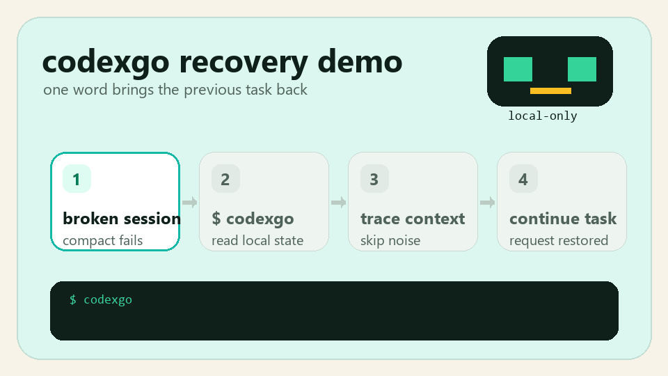
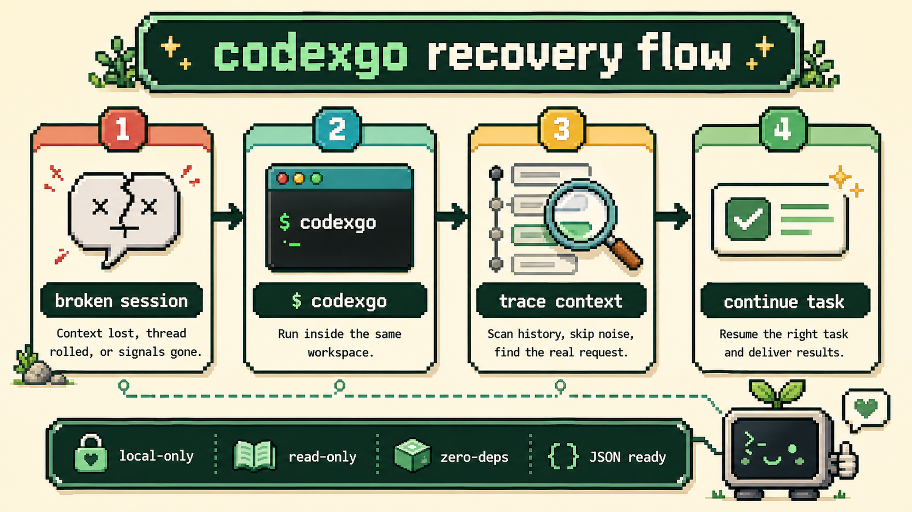

<p align="center">
  
</p>

<h1 align="center">codexgo</h1>

<p align="center">
  <strong>一个很小的 Codex 断点恢复 skill。</strong><br>
  从本地会话记录里找回上一轮真正要继续的任务。
</p>

<p align="center">
  <a href="README.en.md">English</a>
  ·
  <a href="https://github.com/JY0xLU/codexgo">GitHub</a>
</p>

<p align="center">
  <a href="https://github.com/JY0xLU/codexgo/stargazers"></a>
  <a href="https://github.com/JY0xLU/codexgo/network/members"></a>
  
  
  
  <a href="LICENSE"></a>
  
</p>

## 是什么

`codexgo` 用来处理一个很具体的问题：你刚把任务讲清楚，Codex 正在做，线程却因为 compact、崩溃或上下文丢失断掉了。新开一个会话输入 `codexgo`，它会从本地 Codex 状态和 rollout 记录里推回最应该继续的请求。

## 亮点

| 特性 | 说明 |
| --- | --- |
| 小 | 一个 Python 脚本，一个 skill 文件，标准库实现 |
| 安全 | 只读本地 Codex 数据，不上传对话，不修改数据库 |
| 懂上下文 | 会跳过低信息回复，并向上追溯 `三端`、`这个方案` 等模糊引用 |
| 可脚本化 | 同时支持普通文本输出和 JSON 输出 |
| 适合学习 | 逻辑集中、依赖极少，方便读代码和改造 |

## 30 秒安装

macOS / Linux：

```bash
mkdir -p ~/.codex/skills
git clone https://github.com/JY0xLU/codexgo.git ~/.codex/skills/codexgo
```

Windows PowerShell：

```powershell
New-Item -ItemType Directory -Force "$HOME\.codex\skills" | Out-Null
git clone https://github.com/JY0xLU/codexgo.git "$HOME\.codex\skills\codexgo"
```

重启 Codex，然后在新会话开头输入：

```text
codexgo
```

## 快速演示

<p align="center">
  
</p>

## 使用图

<p align="center">
  
</p>

## 它会处理什么

| 中断前最后一条消息 | codexgo 怎么判断 |
| --- | --- |
| 真正的任务 | 直接返回这条任务 |
| `continue` / `go on` / `继续` | 向前找到上一条真实请求 |
| `ok` / `yes` / `好的` | 恢复你刚刚同意的助手方案 |
| `补充：...` | 把补充内容和前面的上下文合并 |
| `三端` / `这个方案` / `按上面` | 自动向上扩展 supporting context |
| 选型或方案比较 | 输出 `decision_basis_message` 作为决策依据 |
| 需要接入脚本 | 输出 JSON，交给其他工具继续处理 |

JSON 输出里会包含 `context_expanded_upward`，用于标记是否为了消解模糊引用而向更早的对话扩展了上下文。

## 输出示例

普通文本输出：

```text
Recovered Codex request
- matched workspace: /path/to/project
- source: user_message
- needs more context: False
- context expanded upward: False

Resolved request:
Finish the README polish and run the tests.
```

JSON 输出适合脚本接入：

```json
{
  "status": "ok",
  "resolved_request": "Finish the README polish and run the tests.",
  "resolved_source": "user_message",
  "decision_basis_message": "",
  "context_expanded_upward": false
}
```

## 安全和隐私

- 只读取本机 `~/.codex/state_*.sqlite` 和 rollout JSONL。
- 不上传对话、不调用网络、不写入 Codex 数据库。
- 不修改当前项目文件，除非你把输出交给其他自动化脚本继续执行。
- 出错时会返回错误信息，不会伪造恢复结果。

## 命令行

```bash
python scripts/codexgo.py --cwd . --format text
python scripts/codexgo.py --cwd . --format json
```

常用参数：

```text
--cwd <path>         工作区路径，默认是当前目录。
--codex-home <path>  Codex 数据目录，默认是 CODEX_HOME 或 ~/.codex。
--scope <mode>       搜索范围：auto、exact、repo、tree，默认是 auto。
--skip-current       跳过当前 thread，默认启用。
--recent <n>         输出最近几条用户消息，默认是 3。
--lookback <n>       输出多少条附近上下文，默认是 6。
--format <fmt>       text 或 json，默认是 text。
```

## 要求

- Python 3.10+
- 本地存在 Codex 状态目录 `~/.codex`
- 不需要第三方 Python 依赖

## 限制

- Codex 本地状态目录必须存在，否则没有历史记录可恢复。
- 如果 Codex 未来改动 SQLite schema 或 rollout 格式，可能需要更新解析逻辑。
- 模糊引用追溯是规则型逻辑，不是 LLM 语义推理。
- 在同一工作区或同一 Git 仓库中恢复效果最好。

## Star History

<p align="center">
  <a href="https://www.star-history.com/#JY0xLU/codexgo&Date">查看 Star History</a>
</p>

## 开发

运行测试：

```bash
python -m pytest tests/test_codexgo.py -p no:cacheprovider
```

## License

Apache-2.0
